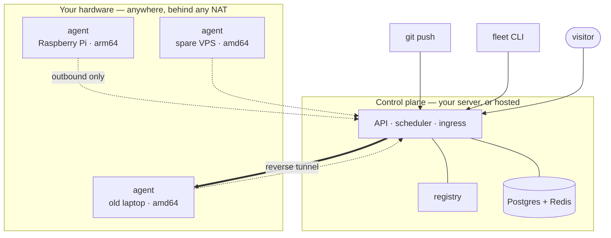

<h1 align="center">Fleet OS</h1>

<p align="center">
  <strong>Git push to the hardware you already own.</strong><br>
  A Raspberry Pi, an old laptop and a spare VPS, treated as one deploy target.
</p>

<p align="center">
  <a href="https://fleet.plastikworld.xyz"><b>Website</b></a> ·
  <a href="docs/ARCHITECTURE.md"><b>Architecture</b></a> ·
  <a href="docs/fleet-yaml-spec.md"><b>fleet.yaml</b></a> ·
  <a href="docs/self-hosting.md"><b>Self-hosting</b></a>
</p>

<p align="center">
  <a href="LICENSE"></a>
  <a href="https://github.com/YadurajManu/fleet-os/actions"></a>
  <a href="https://www.npmjs.com/package/@yadurajfleetos/cli"></a>
  <a href="https://go.dev/"></a>
  <a href="https://nodejs.org/"></a>
</p>

---

```console
$ fleet nodes pair                 # prints a single-use command to run on the machine
$ fleet init                       # writes a fleet.yaml, scaffolds a Dockerfile if needed
$ fleet up web                     # apply → build for that node's arch → deploy → wait → URL
```

Fleet OS turns the computers you already own into one deploy target. Push a repository and it builds the declared services, places each one on a node that can run it, exposes a stable HTTPS hostname, and reschedules flexible workloads when a Raspberry Pi, laptop, or spare VPS disappears. It is for homelabs, small teams, and operators who need useful orchestration without replacing their hardware or pretending that every node is identical.

Agents are **outbound-only**. There is no inbound Docker socket, no SSH key on your machines, and no port to forward — a node behind a home router with no static IP is a first-class member of a fleet.

## Why Fleet OS

Coolify, Dokploy, and CapRover are excellent single-server deployment tools, but their scheduling model assumes one stable host (or a fairly uniform cluster). Balena assumes a fleet of similarly managed devices. Fleet OS makes heterogeneous, intermittently connected hardware the design centre: capability discovery is reported by agents, placement explains rejected nodes, and pinned stateful services are treated differently from movable stateless services.

## What it provides

- GitHub push deployments at the exact pushed commit, including private-repository access through a GitHub App. An App installation belongs to exactly one organisation, so a shared control plane never lets one tenant reach another's repositories.
- Import a repository from the dashboard and it deploys immediately — pushes arrive at the App's own webhook, so there is no per-repository webhook to configure.
- `fleet.yaml` validation, dry-run placement plans, architecture-aware builds, and registry-backed image rollout.
- Deploy from a local directory with no git remote: `fleet up` uploads the build context itself.
- A manifest is a project. Its services stay grouped after they are applied, in both the CLI and the dashboard.
- Encrypted secrets with per-secret keys, injected only into the services that declare them, and importable straight from a `.env`.
- Health-gated rollouts: the release that works keeps serving until its replacement proves it can serve too.
- Weighted scheduling across CPU, memory headroom, reliability tier, tags, GPU, affinity, and anti-affinity constraints.
- Heartbeat-based liveness, cordon/drain controls, automatic failover for flexible services, and explicit handling for pinned services.
- Agent runtime telemetry: Docker availability/version, registry pull status, disk pressure, reconciliation errors, and bounded log tails.
- CLI and dashboard workflows for health checks, logs, deployments, restart, rollback, events, and signed alerts.
- Self-hosted control plane with Postgres, Redis, a local registry, and optional Cloudflare Tunnel ingress.

## Architecture

The control plane owns identity, fleet state, scheduling, builds, ingress routes, and deployment history. A small Go agent runs on each node, reports capabilities and heartbeats over outbound HTTPS, and reconciles the desired container state locally; it never requires an inbound Docker or SSH port.



Every arrow from a node points *outward*. The control plane never opens a connection to your hardware — it answers polls and holds a reverse tunnel for ingress, which is what lets a machine on a college LAN or a home router serve traffic without a port forward. See [Architecture](docs/ARCHITECTURE.md) for the data flow and failure model.

## Quickstart

Install the CLI:

```bash
npm install -g @yadurajfleetos/cli
fleet auth login
```

Create a fleet and pair a node. `fleet nodes pair` prints a single-use command; run that command on the Raspberry Pi, laptop, or VPS you want to add:

```bash
fleet nodes pair
# run the printed curl ... --token flp_... command on the node
fleet status
```

In a repository with a `Dockerfile` (or let Fleet scaffold one), declare a service and push it:

```bash
fleet init
# review fleet.yaml, then:
fleet validate
fleet up web                 # apply, build, deploy, wait for running, print URL
# or use separate, reviewable steps:
fleet apply
fleet deploy web
git add fleet.yaml Dockerfile
git commit -m "deploy web"
git push
```

Secrets never go in the manifest. Name them there and store the values separately — or import the ones you already have:

```bash
fleet secrets set POSTGRES_PASSWORD          # prompts, never echoed
fleet secrets import .env --dry-run          # shows keys, never values
```

For a self-hosted control plane, follow [Self-hosting](docs/self-hosting.md).

## Stack

- Go agent with static cross-compiled binaries for Linux, macOS and Windows (`arm64`, `armv7`, `amd64`). On Windows it speaks to the Docker Engine over its named pipe.
- TypeScript control plane on Fastify, Drizzle ORM, Postgres, Redis, and Docker Buildx.
- TypeScript CLI distributed as an npm package.
- React dashboards and a Vite marketing site, served by nginx containers.
- Docker Compose for local/self-hosted operation; Cloudflare Tunnel for optional public ingress.

## Documentation

| Guide | Contents |
| --- | --- |
| [Architecture](docs/ARCHITECTURE.md) | Control plane, agents, scheduling, heartbeats, and failover |
| [Data model](docs/DATA_MODEL.md) | Entities, lifecycle, and relationships |
| [Self-hosting](docs/self-hosting.md) | Run the control plane, add nodes, tunnel, registry, GitHub, diagnostics, backup |
| [fleet.yaml](docs/fleet-yaml-spec.md) | Manifest schema, secrets, volumes, health, and placement semantics |

## Contributing

Bug reports, design discussions, and pull requests are welcome.

```bash
git clone https://github.com/YadurajManu/fleet-os.git && cd fleet-os
cd control-plane && npm ci && npm run typecheck && npm test   # needs Postgres + Redis
cd ../cli && npm ci && npm test
cd ../dashboard && npm ci && npm run build
cd ../agent && go test ./...
```

The control-plane tests need a Postgres and a Redis to talk to; `.github/workflows/ci.yml` shows the exact environment they expect, and copying `control-plane/.env.example` to `.env.test` is the local equivalent.

Commits describe the behaviour that changed and why it was wrong before — see `git log` for the house style. [CONTRIBUTING.md](CONTRIBUTING.md) has the rest: repository layout, what makes a bug report actionable, and what a pull request should contain.

## Security

Please do not open a public issue for anything exploitable. Email
**security@fleet-os.dev** or use [private vulnerability reporting](https://github.com/YadurajManu/fleet-os/security/advisories/new).
[SECURITY.md](SECURITY.md) sets out response times, safe harbour for good-faith
research, and the design boundaries — outbound-only agents, per-organisation
GitHub installations, envelope-encrypted secrets — that are meant to hold.

## Who maintains this

Fleet OS is built and maintained by [Yaduraj Singh](https://fleet.plastikworld.xyz/#/founder),
alone, in the open. That page says what a one-person project can promise you and
what it cannot — including the parts that might make you decide against it.

## License

Fleet OS is released under the [MIT License](LICENSE). No open-core split, no
enterprise fork holding the good parts: what is here is the product.
