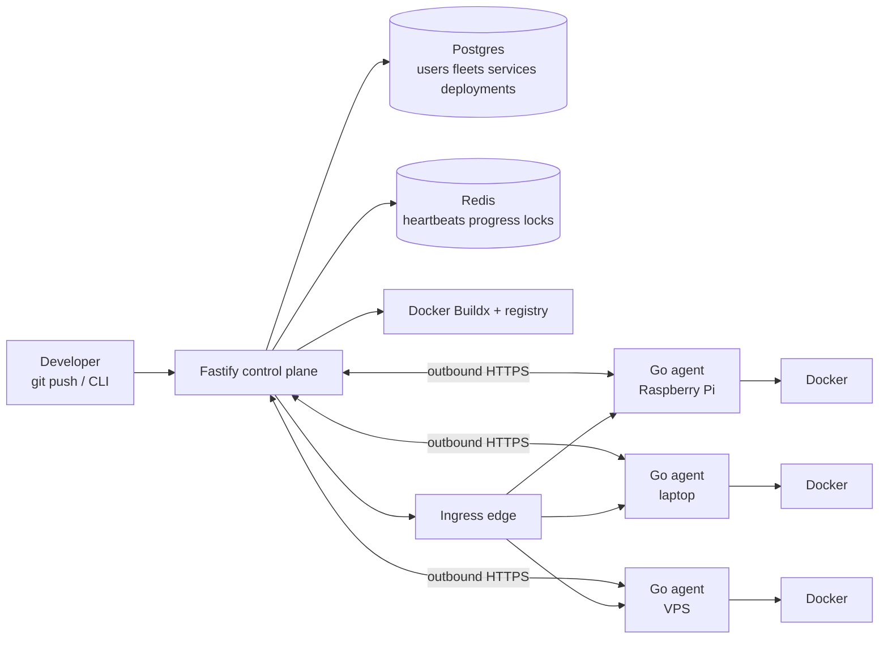
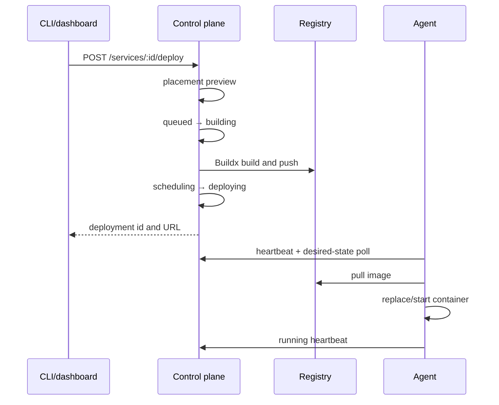

# Architecture

Fleet OS has a stateful control plane and a deliberately small node agent. The control plane is the source of truth for identity, manifests, deployments, placement decisions, and ingress routes. Agents are execution points: they discover local capabilities, send outbound telemetry, and reconcile the containers assigned to them.

## Control plane

The Fastify service exposes the REST API used by the CLI, dashboard, agents,
and GitHub webhook. Drizzle persists users, organizations, fleets, nodes,
services, deployments, placement events, secrets, and audit records in
Postgres. Redis stores short-lived heartbeat payloads and build-progress lines;
loss of Redis costs a liveness interval, not deployment history.

Builds run centrally through Docker Buildx. A build produces tags for every
architecture represented by eligible nodes, pushes them to the configured
registry, and only then changes the deployment into the agent-visible
`deploying` phase.

## Agent and node lifecycle

1. An authenticated user requests a pairing token. It is single-use and expires
   after ten minutes; only its hash is stored.
2. The installer downloads the matching static binary, detects OS and
   architecture, and calls `/agent/register`.
3. Registration records capabilities and returns a long-lived agent token. The
   agent stores that token in its local state file and starts its supervisor.
4. Every heartbeat reports CPU, RAM, disk, containers, Docker runtime data,
   registry-pull status, and bounded log tails. The agent also polls
   `/agent/desired-state` and reconciles Docker to that state.

Agents make outbound connections only. Ingress can reach a node using its
advertised address; deployments spanning NAT boundaries require a reachable
LAN address today (mesh transport is an explicit future extension).

## Liveness and health

Heartbeat payloads are written to a Redis TTL key and a per-fleet sorted set.
The sweeper queries the sorted set using the fleet interval and miss threshold.
Nodes are marked offline only on a state transition; cordoned nodes are not
swept. A persisted Postgres timestamp is used as a restart-safe fallback when
one exists, while Redis remains authoritative for fresh heartbeats.

Runtime telemetry is advisory but concrete: Docker availability and version,
the last image-pull result, disk pressure, and the latest reconciliation error
are displayed by `fleet doctor` and the dashboard Doctor page. Stale telemetry
is never presented as a current healthy reading.

## Placement

Placement is a pure filter-and-rank decision over a fleet snapshot:

1. Filter offline/cordoned nodes, architecture, RAM, GPU, reliability tier,
   required tags, pinning, volumes, affinity, and anti-affinity.
2. Return every rejection with a reason instead of hiding the first failure.
3. Rank survivors by memory headroom, reliability, and load. Ties are
   deterministic, so repeated decisions do not flap between nodes.

`flexible` services may move, `preferred` services favour a node but can move,
and `pinned` services never move. A persistent volume anchors a service to its
node. `fleet where <service>` exposes the same candidates, scores, and
rejections used by the scheduler.

## Deployment flow

The CLI follows the deployment progress endpoint while the request is active,
so its ladder reports real server phases rather than guessed spinner labels.
Failed builds remain as failed deployment rows with a sanitized reason. A
sweeper marks abandoned pre-deploy rows failed after the configured build
timeout plus slack.

## Failover

When a node transitions offline, the control plane evaluates each live
deployment there. Flexible services receive a new placement and deployment;
the old row becomes `superseded`, preserving the timeline. Pinned services
become `pinned_unavailable`, raise a distinct event, and remain associated with
their node until it returns. On recovery, the reclaim policy (`eager`, `idle`,
or `manual`) determines whether preferred workloads move back.
