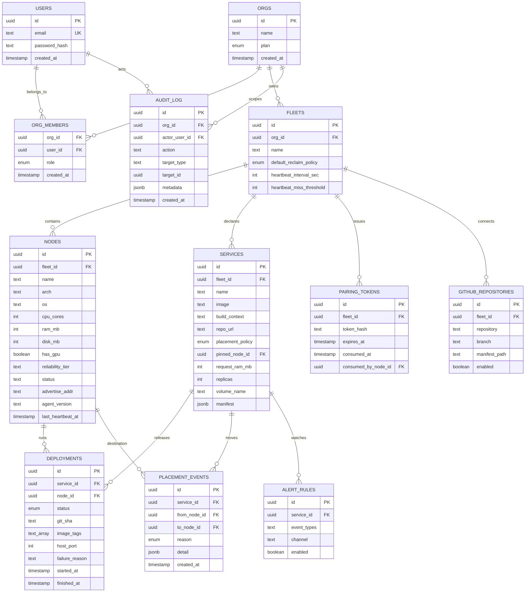

# Data model

Postgres stores durable identity, topology, desired configuration, and release
history. Redis stores only expiring liveness and progress data.

## Relationships and lifecycle

- Deleting an organization cascades to its memberships, fleets, nodes, and
  services. Audit rows retain actor context where the schema permits it.
- A service has many deployments. A new rollout supersedes the previous live
  deployment; it does not delete it, so rollback and incident history remain
  auditable.
- Deployments reference nodes, but node removal is a revocation operation. The
  service history remains and a flexible service can be rescheduled elsewhere.
- Volumes are represented by service configuration and are intentionally not
  copied during failover. A volume-bearing service is therefore pinned to its
  storage node.
- Heartbeat payloads are not durable entities: Redis keys expire and the latest
  summary is copied into the node row. Logs are bounded agent snapshots, not a
  long-term log store.
